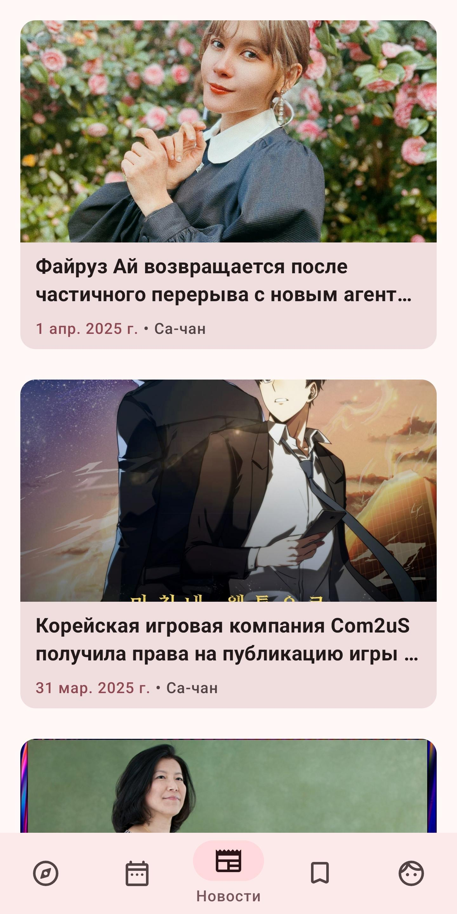
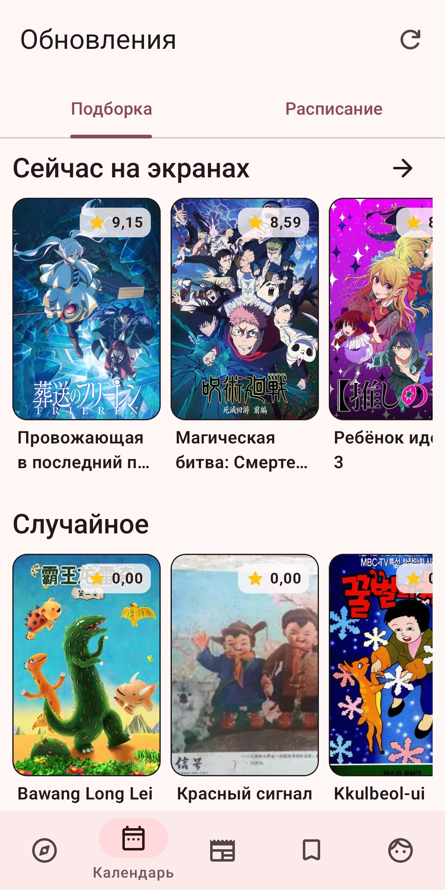
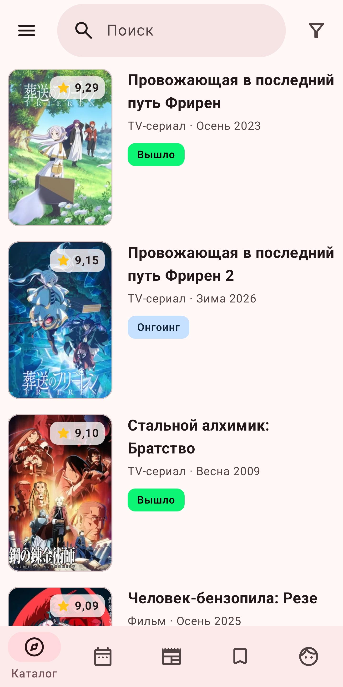
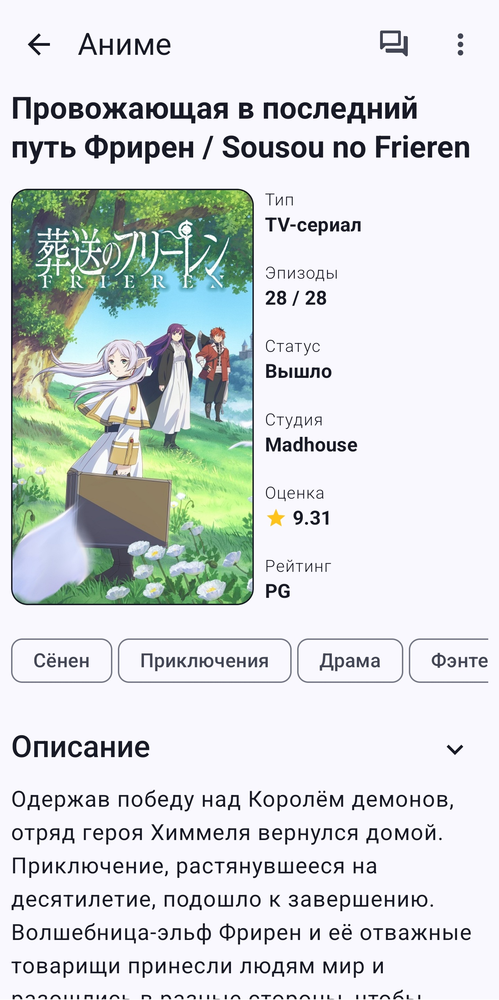
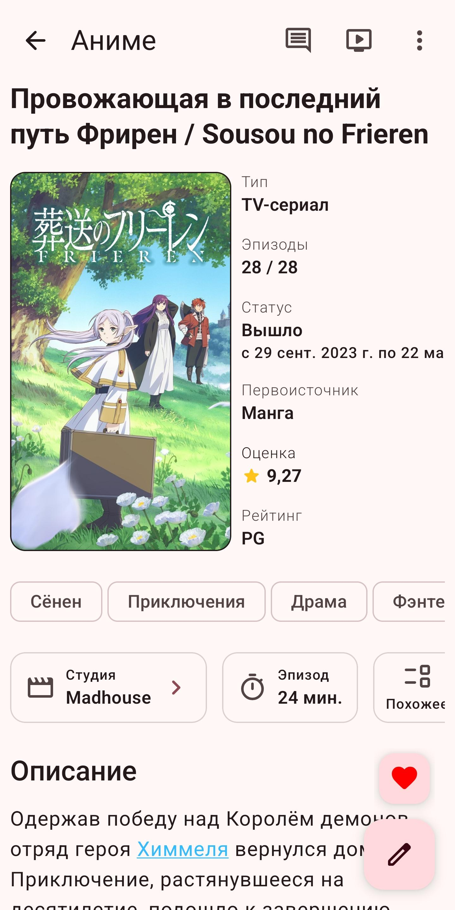
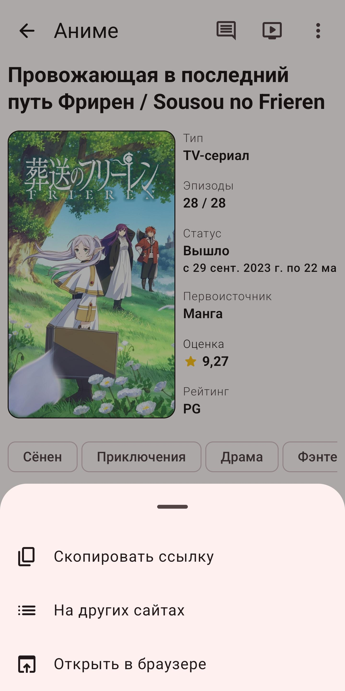
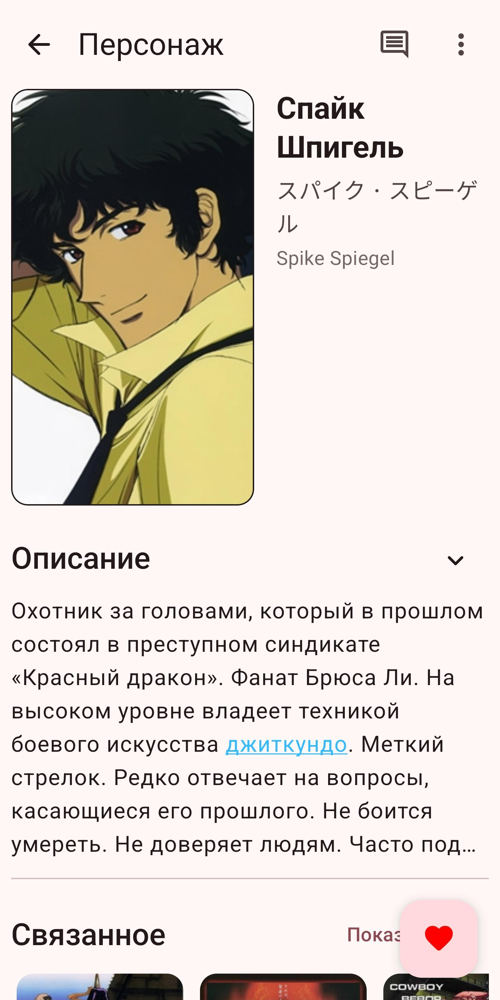
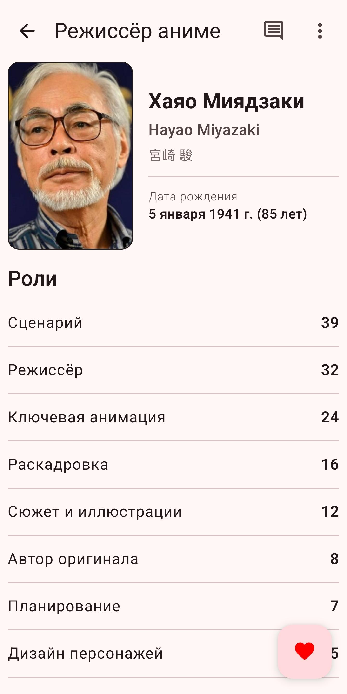
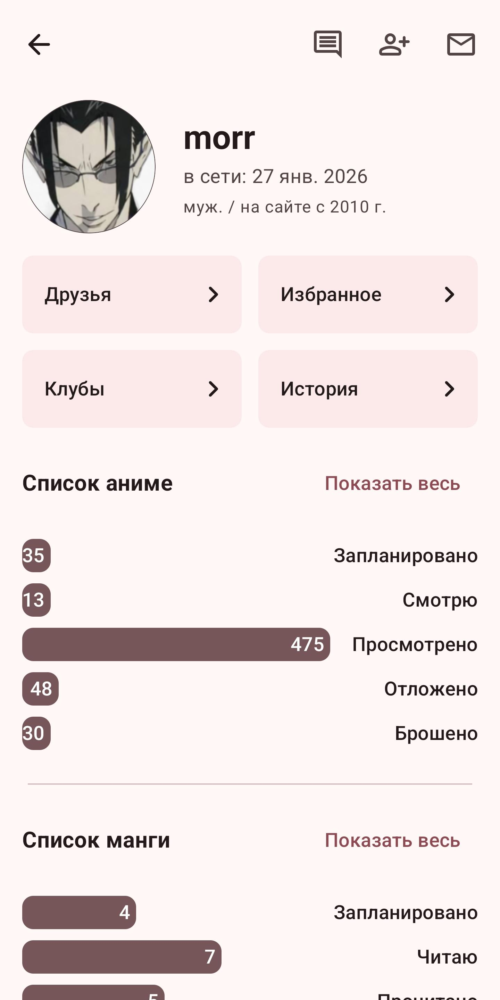
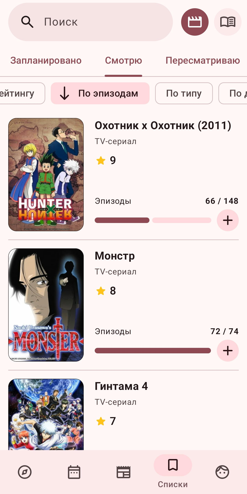

# ShikiApp

Неофициальное мобильное приложение для сайта shikimori.io

 

## Функции

* Поиск и просмотр информации об аниме, манге и ранобэ.
* Поиск и просмотр информации о персонажах и людях.
* Просмотр расписания выхода серий аниме.
* Просмотр доступных серий аниме (демонстрационный просмотр).
* Просмотр и чтение новостей и тем.
* Просмотр профилей пользователей, клубов и друзей.
* Просмотр своих диалогов и отправка сообщений другим пользователям.
* Отправка комментариев, их изменение и удаление.
* Добавление аниме, манги и ранобэ в свой список и в избранное.
* Добавление персонажей и людей в избранное.
* Возможность вступать или выходить в/из клубы (-ов).

## Скриншоты

## Покрытие API

Все возможности приложения можно отслеживать здесь — [Покрытие API](https://github.com/users/pewaru-333/projects/7)