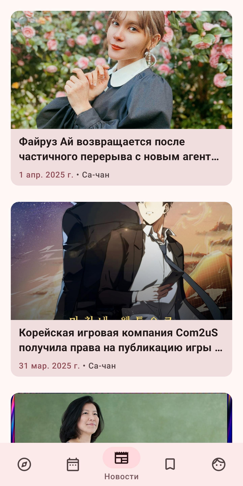
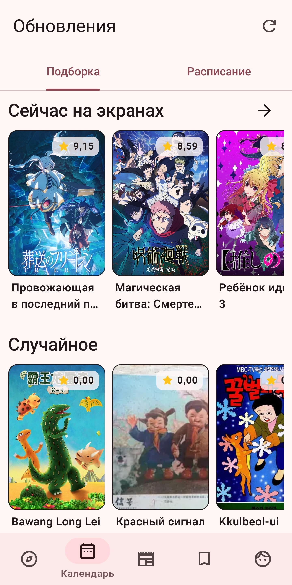
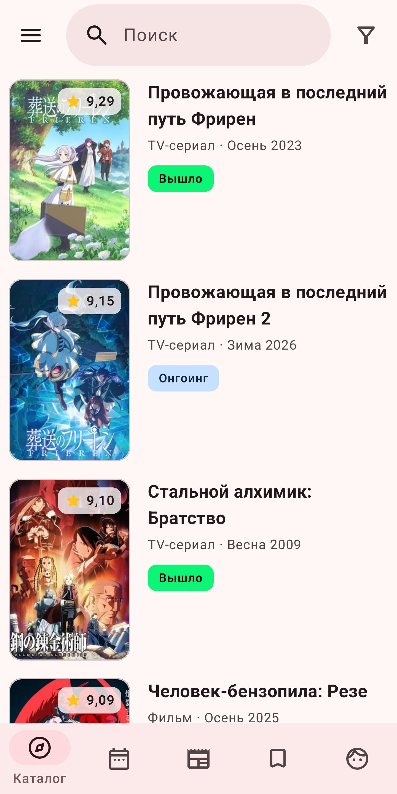
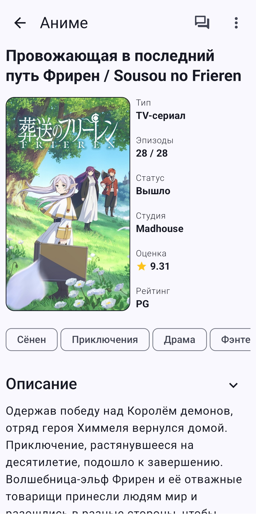
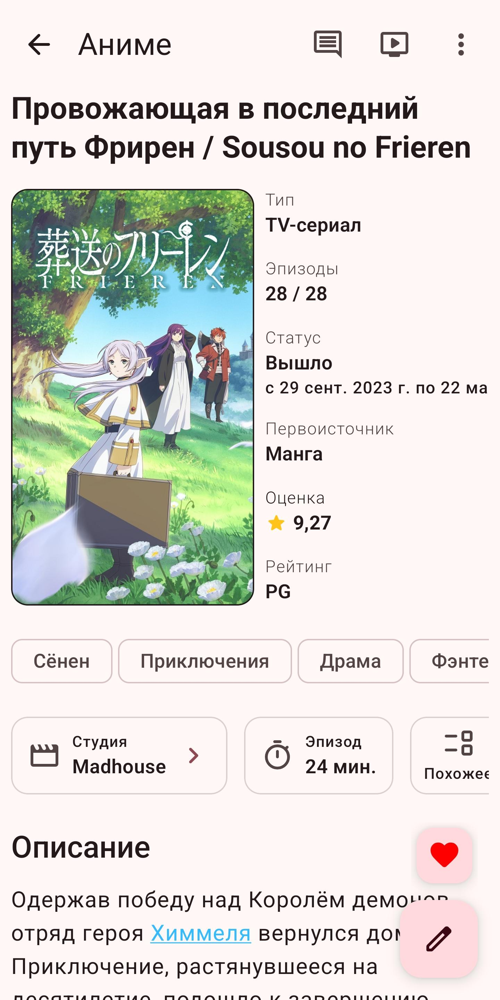
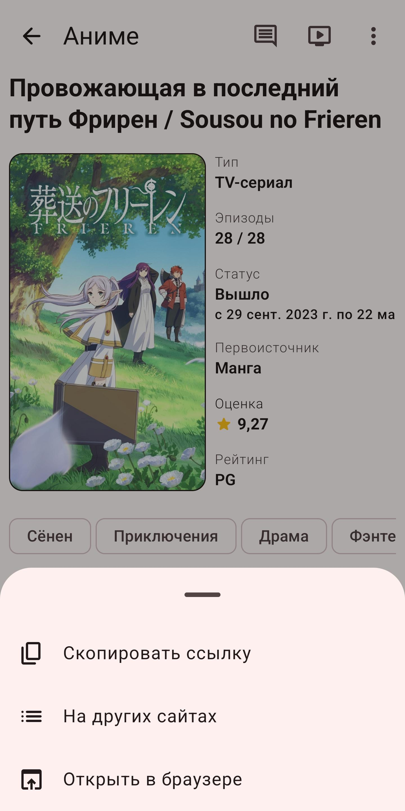
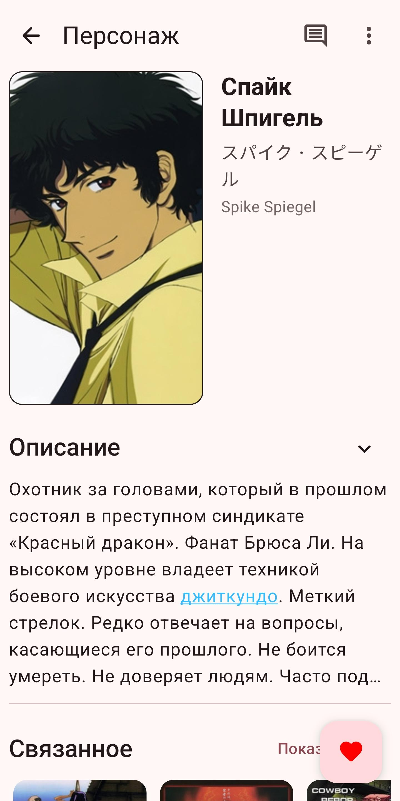
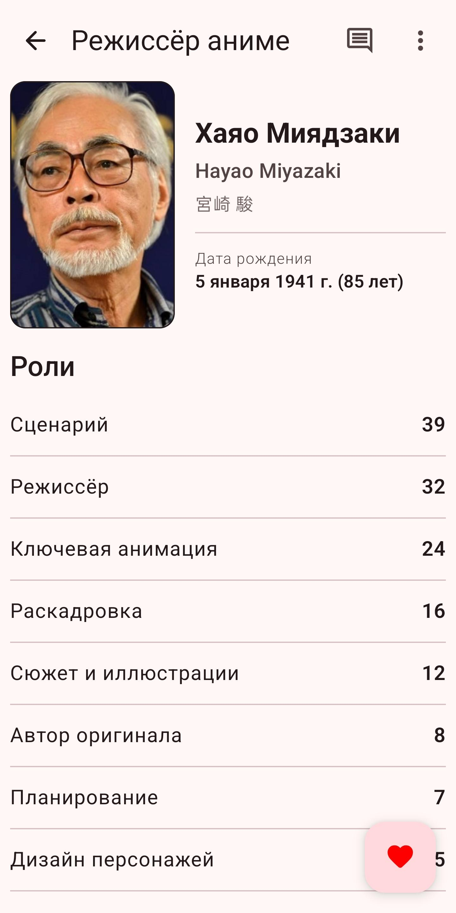
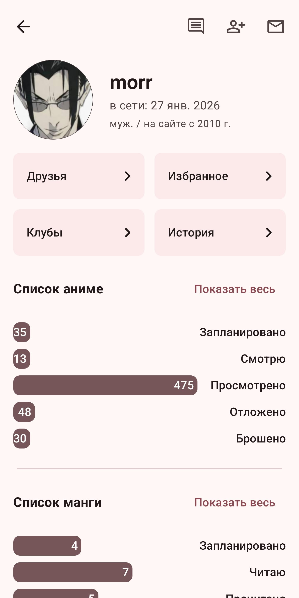
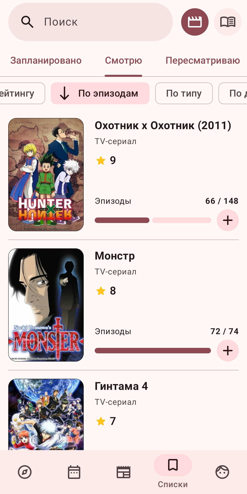

# ShikiApp

Неофициальный клиент Shikimori

## Скачать

<table>
  <thead>
    <tr>
      <th>Версия</th>
      <th>Платформы</th>
      <th>Загрузка</th>
    </tr>
  </thead>
  <tbody>
    <tr>
      <td>
        <strong>ShikiApp</strong> 
        Клиент для <a href="https://shikimori.io">shikimori.io</a>
      </td>
      <td>Android Windows Linux</td>
      <td>
        &nbsp;&nbsp;
        
      </td>
    </tr>
    <tr>
      <td>
        <strong>ShikiRip</strong> 
        Клиент для <a href="https://shikimori.rip">shikimori.rip</a>
      </td>
      <td>Android iOS Windows Linux</td>
      <td>
         
      </td>
    </tr>
  </tbody>
</table>

## Возможности

- **Каталог:** поиск и просмотр информации об аниме, манге, ранобэ, персонажах и людях.
- **Календарь:** расписание выхода серий аниме.
- **Личные списки:** добавление аниме, манги и ранобэ в свой список, управление избранным.
- **Сообщество:** просмотр профилей, друзей и клубов, вступление в клубы и выход из них.
- **Общение:** просмотр диалогов, отправка сообщений, создание, редактирование и удаление комментариев.
- **Новости:** чтение новостей и тем.
- **Просмотр:** доступные эпизоды аниме (демонстрационный просмотр).

## Скриншоты

## Покрытие API

Реализованные возможности API можно отслеживать на
[доске проекта](https://github.com/users/pewaru-333/projects/7).
